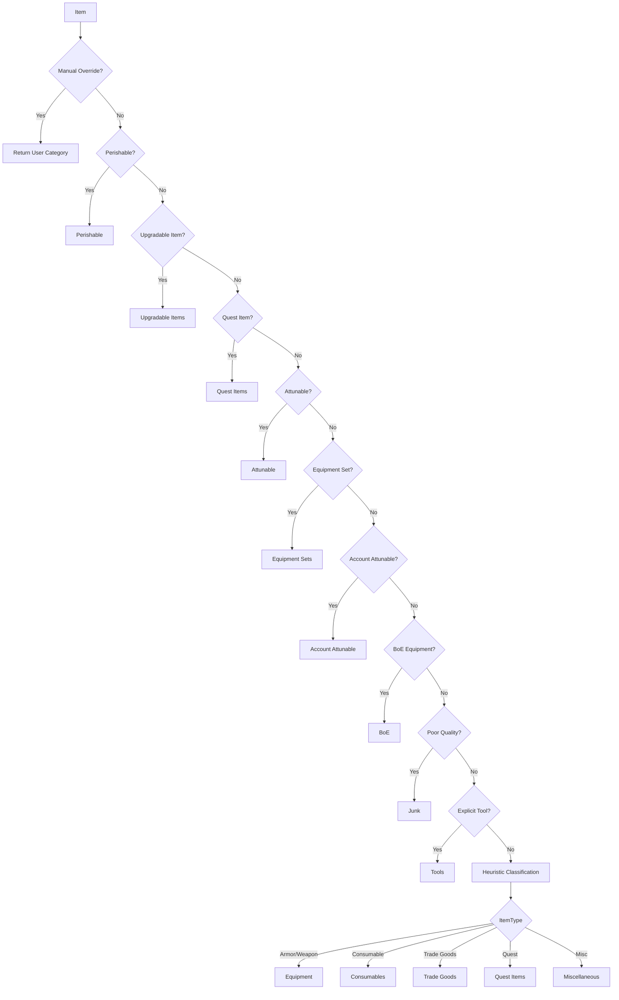

# Feature: Smart Categorization Engine

## Purpose

The Categorizer automatically assigns items to logical categories (Quest, Equipment, Consumables, Trade Goods, etc.) using a priority-based pipeline. This enables AdiBags-style sectioned views without manual user configuration.

## Related

- ADR: (pending)
- Code: `Omni/Categorizer.lua`

---

## Business Rules

1. Every item MUST be assigned exactly one category
2. Categories follow a strict priority pipeline (first match wins)
3. User manual overrides take highest priority
4. Categories are extensible (users can add custom categories)
5. Default categories provide "Smart Defaults" out of the box
6. Explicit item-ID registries can force items into a dedicated category before generic type-based heuristics run

---

## Category Priority Pipeline



---

## Default Categories

| Registered Priority | Category | Detection Method |
|---------------------|----------|------------------|
| 1 | Perishable | Explicit itemID registry plus SavedVariables extension |
| 1.8 | Upgradable Items | Explicit itemID allowlist for known upgradeable items |
| 2 | Quest Items | `GetContainerItemQuestInfo()` |
| 3 | Attunable | Attune API and hyperlink progress resolution |
| 4 | Equipment Sets | `GetEquipmentSetItemIDs()` |
| 4.5 | Account Attunable | Account-wide attune availability checks |
| 5 | BoE | Bind type plus equipment detection |
| 6 | New Items | Session overlay for newly acquired items; does not replace the primary category |
| 10 | Equipment | ItemType == "Armor" or "Weapon" |
| 11 | Consumables | ItemType == "Consumable" |
| 12 | Trade Goods | ItemType == "Trade Goods" |
| 13 | Reagents | ItemType == "Reagent" or reagent subtype |
| 14 | Tools | Explicit itemID registry |
| 15 | Keys | ItemType == "Key" |
| 16 | Bags | ItemType == "Container" or quiver-style bag |
| 17 | Ammo | ItemType == "Projectile" |
| 18 | Glyphs | ItemType == "Glyph" |
| 90 | Junk | Quality == 0 (Poor/Grey) |
| 99 | Miscellaneous | Fallback for unmatched items |

Manual overrides sit above the registered categories and always win. `Tools` are checked before the final heuristic fallback even though they sort at registered priority `14`.

### Upgradable Items

The categorizer supports a dedicated `Upgradable Items` category backed by an explicit item-ID allowlist. This category is evaluated before quest, attune, and generic equipment heuristics so curated upgrade-path items stay grouped together instead of being scattered across broader buckets.

---

## API Reference

### Categorizer:Init()
Initialize the categorizer, load user overrides from SavedVariables.

### Categorizer:GetCategory(itemInfo) → string
Returns the category name for an item.

**Parameters:**
- `itemInfo` — Table from `OmniC_Container.GetContainerItemInfo()`

**Returns:**
- `categoryName` — String like "Quest Items", "Equipment", etc.

### Categorizer:SetManualOverride(itemID, categoryName)
Assign an item to a specific category (persisted).

### Categorizer:ClearManualOverride(itemID)
Remove manual override, revert to automatic.

### Categorizer:GetAllCategories() → table
Returns list of all category definitions with priorities.

### Categorizer:RegisterCategory(name, priority, filterFunc)
Register a custom category with filter function.

---

## Data Structures

### Category Definition
```lua
{
    name = "Quest Items",
    priority = 2,
    icon = "Interface\\QuestFrame\\UI-QuestLog-BookIcon",
    color = { r = 1, g = 0.82, b = 0 },
    filter = function(itemInfo) return itemInfo.isQuestItem end,
}
```

### Manual Overrides (SavedVariables)
```lua
OmniInventoryDB.categoryOverrides = {
    [12345] = "My Tank Set",  -- itemID → category name
    [67890] = "Profession",
}
```

---

## Test Flows

### Positive Flow: Quest Item Detection

**Precondition:** Character has a quest item in bags

1. Get item info via `OmniC_Container.GetContainerItemInfo()`
2. Call `Categorizer:GetCategory(itemInfo)`
3. Verify returns "Quest Items"

**Expected:** Quest items correctly categorized

### Positive Flow: Manual Override

**Precondition:** User has set manual override for itemID 12345

1. Get item info for itemID 12345
2. Call `Categorizer:GetCategory(itemInfo)`
3. Verify returns the user-assigned category

**Expected:** Manual override takes priority

### Positive Flow: Upgradable Item Allowlist

**Precondition:** Character has a bag item whose item ID exists in the maintained Upgradable Items allowlist

1. Get item info for the allowlisted item
2. Call `Categorizer:GetCategory(itemInfo)`
3. Verify returns `Upgradable Items`

**Expected:** Explicitly tracked upgradeable items land in their dedicated category

### Negative Flow: Unknown Item

**Precondition:** Item has no matching rules

1. Get item info for misc item
2. Call `Categorizer:GetCategory(itemInfo)`
3. Verify returns "Miscellaneous"

**Expected:** Fallback category used

### Edge Case: Equipment Set Item

**Precondition:** Item belongs to saved equipment set

1. Get item info
2. Call `Categorizer:GetCategory(itemInfo)`
3. Verify returns "Equipment Sets"

**Expected:** Equipment set detection works

### Edge Case: Upgradable Quest or Equipment Item

**Precondition:** Character has an item from the Upgradable Items allowlist that would otherwise match `Quest Items`, `Attunable`, or `Equipment`

1. Get item info for the allowlisted item
2. Call `Categorizer:GetCategory(itemInfo)`
3. Verify returns `Upgradable Items`

**Expected:** The explicit allowlist wins over broader automatic category heuristics

---

## Definition of Done

- [x] `Omni/Categorizer.lua` implements priority pipeline
- [x] Quest Items detected via API
- [x] Manual overrides persist in SavedVariables
- [x] Heuristic fallback for unknown items
- [x] All test flows verified in-game
- [x] ADR documented (ADR-001 covers architecture)
